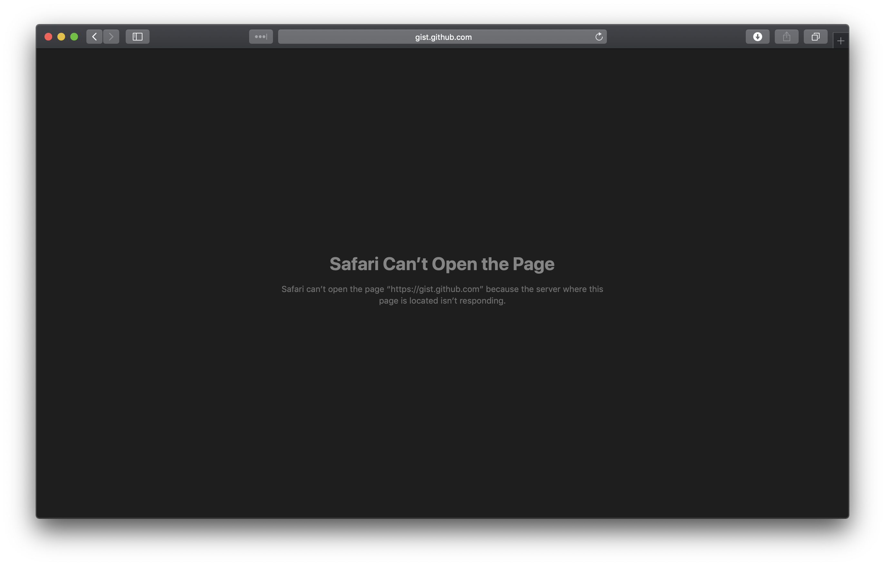
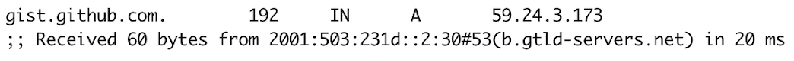

If you visit gist.github.com in China, you might find:



## What happened?

`dig +trace gist.github.com`, found the A record of gist.github.com was returned by a generic top level domain (gTLD) name server, which was not [the expected](https://vjyq.github.io/wcrXic/).



## Make it reachable

Open your terminal, `sudo vi /etc/hosts`, add the following line, then save:

```
192.30.253.119  gist.github.com
```

Here you go:


<div><a href="https://vjyq.github.io/daily"></a></div><div style="border-top:1px solid #e1e4e8;padding-top:16px"></div>
<div>© 2018-2020 by YUQING JI</div>
<div style="padding-top:0.3em"><a href="https://vjyq.github.io/en/about">About</a> | <a href="https://vjyq.github.io/">Blog</a> | <a href="mailto:yuqing.ji@outlook.com">Email</a> | <a href="https://github.com/vjyq">Github</a> | <a href="https://vjyq.github.io/zh">中文</a></div>